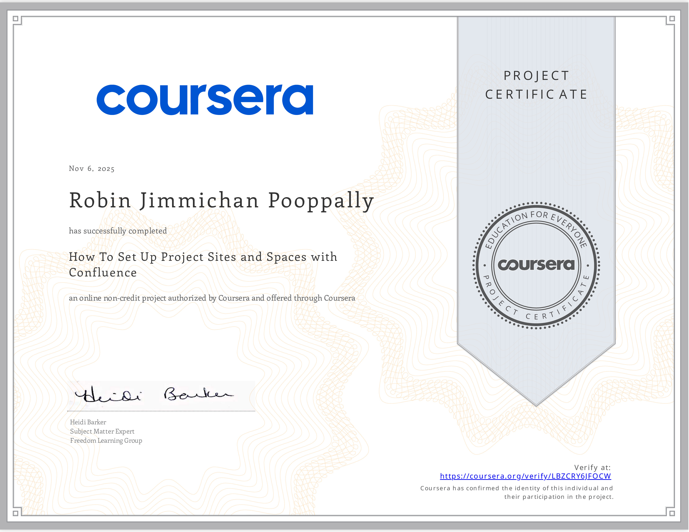

# 📜 Robin Jimmichan P – Certifications

This repository showcases all professional certifications completed by Robin Jimmichan P in **Business Analytics, Data Analysis, AI, and Programming**. Each certificate includes a brief description of skills learned, credential ID, and an image for easy viewing.

---

## 📂 Certificates

| # | Certification | Credential ID | Description | Image |
|---|---------------|---------------|-------------|-------|
| 1 | How To Set Up Project Sites and Spaces with Confluence - Coursera| LBZCRY6JFOCW | Completed a course on setting up project and team spaces in **Confluence**. Learned to create, organize, and manage spaces, configure permissions, customize sidebars, and integrate external content for effective collaboration.|  |
| 2 | Business Analytics with AI Training – Internshala | hglw9p9shkg | Completed a 6-week program covering **Excel, SQL, Power BI, Python, statistics, and AI-powered analytics**. Learned data cleaning, analysis, visualization, statistical & AI techniques, and scored 74% in final assessment. |  |
| 3 | Business Analytics – Skill India & NSDC | l6rop5l7zddc6smk | Built expertise in **Excel, SQL, Power BI, Python, and statistics**. Gained hands-on experience in cleaning, analyzing, visualizing data, and applying analytics to derive business insights. |  |
| 4 | Data Analyst – One Roadmap | CERT-29C0E566 | Covered **Excel, SQL, Power BI, Dashboard Building, and Data Visualization**. Developed problem-solving and analytical thinking for real-world business scenarios. |  |
| 5 | Data Classification & Summarization Using IBM Granite | 959de778 | Gained hands-on experience with **Generative AI, LLMs, AI prompt engineering, data classification & summarization**, and text analytics using IBM Granite. |  |
| 6 | Artificial Intelligence Fundamentals – IBM | cd5eb97f | Learned **Machine Learning, NLP, Deep Learning, AI model evaluation, Computer Vision, and IBM Watson Studio**. Completed practical AI projects and capstone exercises. |  |
| 7 | Business Analysis Basics – Simplilearn | 8529336 | Learned foundational BA skills including **requirement gathering, process modeling, stakeholder management, Excel basics, and business analysis concepts**. |  |
| 8 | Business Analyst Assessment – LearnTube.ai | DJA-B-1-1387685-0 | Beginner-level assessment covering **BA roles, SDLC models (Waterfall, Agile), and requirement gathering**. Demonstrated understanding of core BA responsibilities. |  |
| 9 | Power BI Workshop – Office Master | - | Hands-on **Power BI dashboard creation, AI insights, data transformation, 3D visuals, slicers, cards, and reporting**. Practiced real-world BI analytics using Claude.ai and DataSquirrel.ai. |  |
| 10 | Introduction to Programming Using Java – Conduira | 5538222 | Learned **Java fundamentals, OOP, algorithms, problem-solving, and programming logic** through practical exercises and coding tasks. |  |
| 11 | Introduction to Programming Using Python – Conduira | 5538222 | Learned **Python fundamentals, OOP, data handling, and problem-solving**, with hands-on coding projects and exercises. |  |

---

> **Note:** Click on any image to view it full-size. All certificates are authentic and verifiable via the respective issuing organizations.

---

## 🛠 Skills Demonstrated Across Certifications

- **Excel & Power BI**: Pivot Tables, Charts, Formulas, Data Visualization, Dashboard Building  
- **SQL & Python**: Data Cleaning, Data Analysis, Querying, Programming Logic  
- **AI & ML**: Generative AI, LLMs, AI Prompt Engineering, NLP, Deep Learning  
- **Business Analysis**: Requirement Gathering, Process Modeling, Stakeholder Management, SDLC Understanding  

---

This repository serves as a **comprehensive showcase of professional skills, learning journey, and validated expertise** for potential employers, collaborators, or recruiters.

